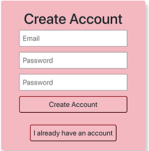

# Life-Organizer

I created this app so that users can save notes to reference in the future. User can login to their account, then access notes specific to their credentials. They can edit those notes.

## How It Works

I predominantly used JavaScript languages to write this app. Languages I used:
* ReactJS for the front end
* SASS for my styling
* MongoDB and Mongoose for my database
* ExpressJS for my server
* NodeJS as my package manager
* FireBase to handle authentication

## User Flow
### Create Account
User can create an account using email. This handles and serves dissmissible alerts if passwords don't match, or if another error is served.

### Log In
User can login. Login handles and serves dissmissible alerts if email/password combination doesn't match.

### Forgot Password
User can select to receive an email to reset their password.

### Logged In
When the user is logged in and have no notes, they'll get a screen prompting them to create their first note. If not, they'll get a screen showing their notes

### Create a Note
The user can add new notes

### Single Note View
The user can edit or delete notes. Clicking cancel toggles the user back to the landing page

## Mobile Design
I used different designs for mobile to create a smoother user experience

